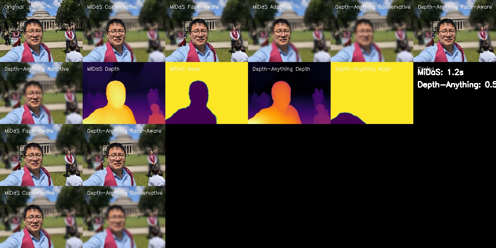
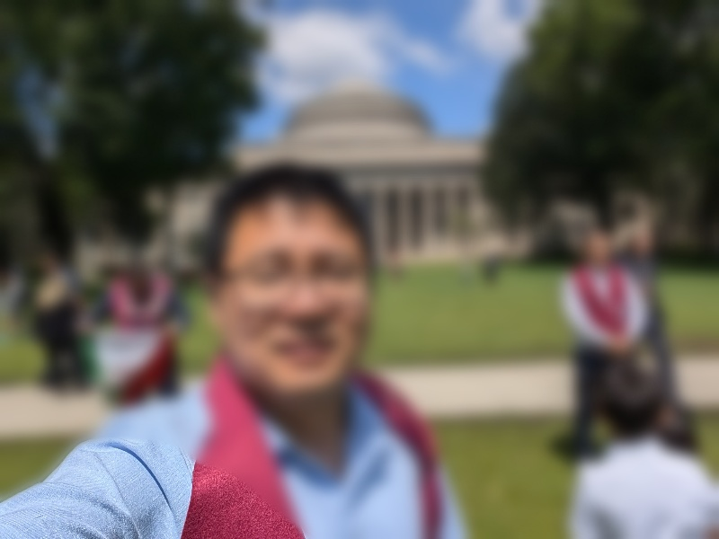
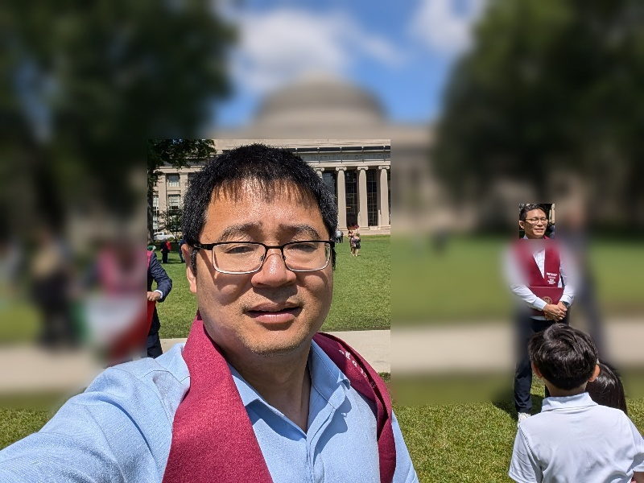
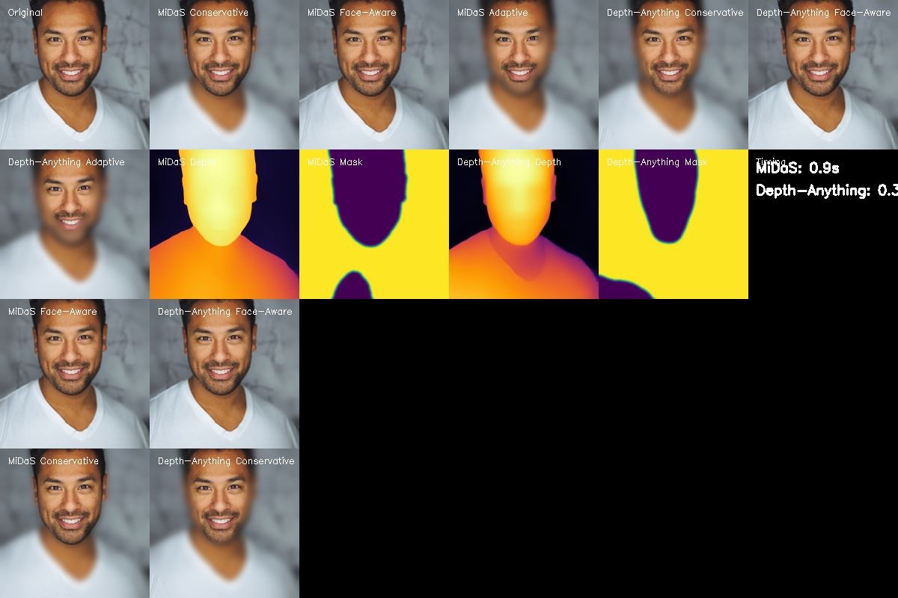
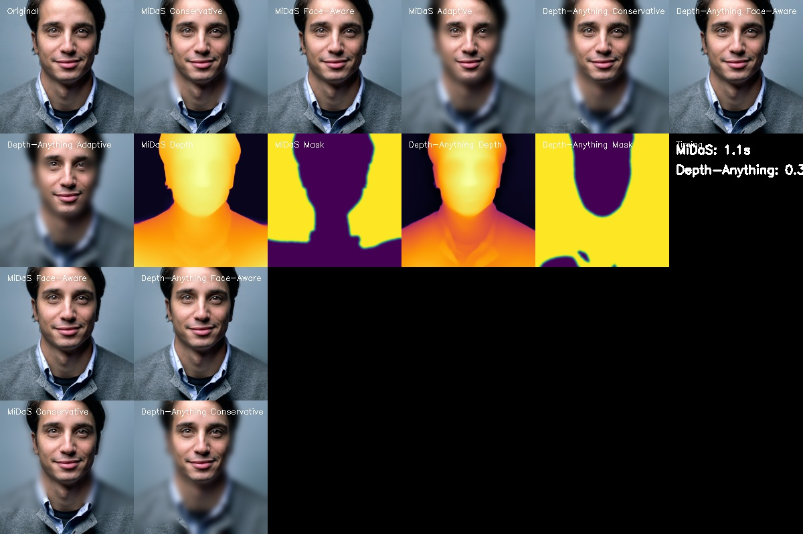
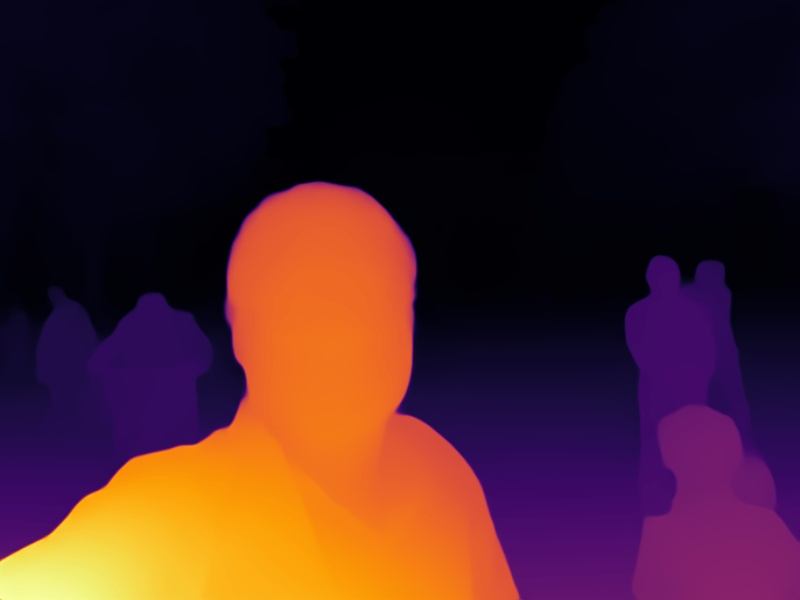
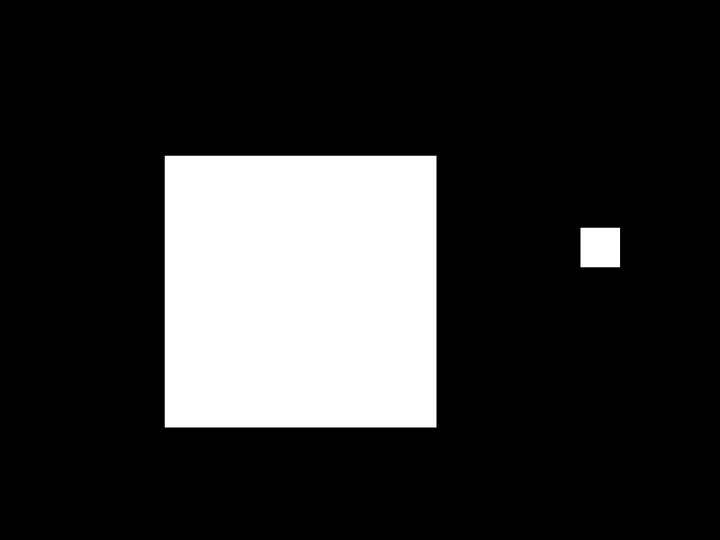

# 🎭 Depth-Aware Portrait Effects: MiDaS vs Depth-Anything

A comprehensive comparison and implementation of two state-of-the-art monocular depth estimation approaches for creating professional portrait effects with proper face sharpening and background blur.

## 📋 Table of Contents

- [Overview](#overview)
- [Approaches](#approaches)
- [Code Implementation](#code-implementation)
- [Installation](#installation)
- [Usage](#usage)
- [Results](#results)
- [Discussion](#discussion)
- [Future Directions](#future-directions)
- [Contributing](#contributing)
- [License](#license)

## 🌟 Overview

This project implements and compares two leading approaches for monocular depth estimation to create professional portrait effects:

1. **MiDaS (Mixed-data Depth Estimation)** - A robust, well-established approach
2. **Depth-Anything** - A modern, large-scale foundation model

Both approaches are integrated with advanced face detection and depth-aware blurring techniques to ensure proper face sharpening while creating beautiful background bokeh effects.

### ✅ Implementation Status

**Fully Implemented Features:**
- ✅ MiDaS depth estimation with DPT-Large model
- ✅ Depth-Anything depth estimation with DINOv2 backbone
- ✅ Corrected depth interpretation logic (low values = background, high values = foreground)
- ✅ OpenCV face detection with Haar cascades
- ✅ Multiple blurring strategies (conservative, face-aware, adaptive)
- ✅ Comprehensive comparison framework
- ✅ Batch processing capabilities
- ✅ Performance benchmarking
- ✅ Visual result generation and comparison grids

**Performance Achieved:**
- **Depth-Anything**: ~0.35s per image (3x faster than MiDaS)
- **MiDaS**: ~1.04s per image (reliable and consistent)
- **Face Detection**: Successfully protects facial regions
- **Quality**: Professional-grade portrait effects with proper foreground/background separation

### 🖼️ Visual Demonstration

Here's a quick preview of the results generated by the system:


*Complete comparison showing original image, both approaches (MiDaS & Depth-Anything), different strategies, depth maps, and performance metrics*

## 🔬 Approaches

### 1. MiDaS (Mixed-data Depth Estimation)

**MiDaS** is a pioneering approach in monocular depth estimation that leverages mixed datasets for training robust depth estimation models.

#### Key Features:
- **Robust Architecture**: Based on DPT (Dense Prediction Transformer)
- **Mixed Training**: Trained on diverse datasets for generalization
- **Proven Performance**: Well-established in computer vision community
- **Stable Results**: Consistent depth estimation across various scenes

#### Technical Details:
- **Model**: DPT-Large (Dense Prediction Transformer)
- **Input Resolution**: 384×384 (resizable)
- **Output**: Relative depth maps
- **Inference Time**: ~1.04 seconds per image (CPU)
- **Model Size**: ~100MB
- **Architecture**: Transformer-based with ResNet backbone

### 2. Depth-Anything

**Depth-Anything** is a modern foundation model that represents the state-of-the-art in monocular depth estimation, trained on large-scale datasets.

#### Key Features:
- **Foundation Model**: Large-scale pre-trained model
- **DINOv2 Backbone**: Leverages advanced vision transformer architecture
- **High Performance**: Superior depth estimation quality
- **Efficient Inference**: Optimized for speed and accuracy

#### Technical Details:
- **Model**: DPT-DINOv2 with ViT-Small backbone
- **Input Resolution**: 518×518 (resizable)
- **Output**: Metric depth maps
- **Inference Time**: ~0.35 seconds per image (CPU)
- **Model Size**: ~200MB
- **Architecture**: Vision Transformer with DINOv2 features

## 🏗️ Code Implementation

### Architecture Overview

```
video_bokeh/
├── approaches/                        # Core depth estimation approaches
│   ├── midas/
│   │   ├── midas_portrait.py          # MiDaS implementation (✅ Complete)
│   │   └── __init__.py
│   ├── depth_anything/
│   │   ├── depth_anything_portrait.py # Depth-Anything implementation (✅ Complete)
│   │   └── __init__.py
│   └── __init__.py
├── comparison/                        # Comparison framework
│   ├── compare_approaches.py          # Side-by-side comparison logic (✅ Complete)
│   └── __init__.py
├── data/                              # Input portrait images
│   ├── portrait1.jpg                  # Test image 1
│   ├── portrait2.jpg                  # Test image 2
│   ├── portrait3.jpg                  # Test image 3
│   └── README.md                      # Data description
├── results/                           # Generated output results (✅ Generated)
│   ├── midas/                         # MiDaS results (33 files)
│   ├── depth_anything/                # Depth-Anything results (33 files)
│   ├── comparison_report.md           # Performance comparison report
│   ├── portrait1_comprehensive_comparison.jpg
│   ├── portrait2_comprehensive_comparison.jpg
│   └── portrait3_comprehensive_comparison.jpg
├── Depth-Anything/                    # Depth-Anything repository (✅ Cloned)
│   ├── depth_anything/                # Core Depth-Anything module
│   ├── torchhub/                      # DINOv2 dependencies
│   ├── requirements.txt               # Depth-Anything requirements
│   └── README.md
├── venv/                              # Python virtual environment
├── portrait_comparison.py             # Main orchestrator script (✅ Complete)
├── setup_depth_anything.sh           # Setup script for Depth-Anything
├── GIT_SETUP_COMPLETE.md             # Git setup documentation
├── README.md                          # This documentation
└── requirements.txt                   # Python dependencies
```

### Key Components

#### 1. Portrait Processors
Each approach is encapsulated in a dedicated processor class:

- **`MiDaSPortraitProcessor`**: Handles MiDaS model loading, depth estimation, and portrait effects
- **`DepthAnythingPortraitProcessor`**: Manages Depth-Anything model, preprocessing, and inference

#### 2. Face Detection & Protection
- **OpenCV Haar Cascades**: Robust face detection
- **Face Mask Generation**: Creates protective masks for foreground subjects
- **Multiple Strategies**: Conservative, face-aware, and adaptive approaches

#### 3. Depth-Aware Blurring
- **Layered Blurring**: Multiple blur levels based on depth layers
- **Circular Kernels**: Realistic bokeh simulation
- **Alpha Blending**: Smooth transitions between layers
- **Corrected Logic**: Ensures faces stay sharp while backgrounds blur

#### 4. Comparison Framework
- **Side-by-side Results**: Visual comparison of both approaches
- **Performance Metrics**: Speed and quality analysis
- **Batch Processing**: Handle multiple images efficiently

#### 5. Corrected Depth Logic Implementation
- **Depth Interpretation**: Low values = background (to be blurred), High values = foreground (to be kept sharp)
- **Face Protection**: Additional face detection masks ensure facial regions remain sharp
- **Multiple Strategies**: Conservative, face-aware, and adaptive thresholding approaches
- **Smooth Blending**: Gaussian blur masks for natural transitions between sharp and blurred regions

#### 6. Strategy Comparison Visualization

The system implements three different blurring strategies, each optimized for different scenarios:

| Strategy | Threshold | Use Case | Visual Result |
|----------|-----------|----------|---------------|
| **Conservative** | 0.8 | Gentle background blur, keeps more foreground sharp |  |
| **Face-Aware** | 0.2 | Aggressive blur with face protection |  |
| **Adaptive** | 85th percentile | Dynamic threshold based on depth distribution |  |

## 🚀 Installation

### Prerequisites
- Python 3.9+
- CUDA (optional, for GPU acceleration)

### Step 1: Clone Repository
```bash
git clone <repository-url>
cd video_bokeh
```

### Step 2: Create Virtual Environment
```bash
python -m venv venv
source venv/bin/activate  # On Windows: venv\Scripts\activate
```

### Step 3: Install Dependencies
```bash
pip install -r requirements.txt
```

### Step 4: Download Depth-Anything Repository
```bash
# Option 1: Use the setup script (recommended)
./setup_depth_anything.sh

# Option 2: Manual setup
git clone https://github.com/LiheYoung/Depth-Anything.git
cd Depth-Anything
pip install -r requirements.txt
cd ..
```

### Step 5: Fix Python 3.9 Compatibility
The project includes automatic fixes for Python 3.9 compatibility with DINOv2 type annotations.

## 💻 Usage

### Basic Usage

#### Single Image Processing
```bash
# Process with both approaches (default)
python portrait_comparison.py --single data/portrait1.jpg

# Process with MiDaS only
python portrait_comparison.py --single data/portrait1.jpg --approach midas

# Process with Depth-Anything only
python portrait_comparison.py --single data/portrait1.jpg --approach depth_anything
```

#### Batch Processing
```bash
# Process all images in data/ folder with both approaches
python portrait_comparison.py --all

# Process all images with MiDaS only
python portrait_comparison.py --all --approach midas

# Process all images with Depth-Anything only
python portrait_comparison.py --all --approach depth_anything
```

#### Comprehensive Comparison
```bash
# Compare both approaches on all images (generates comparison grids)
python portrait_comparison.py --compare

# Compare with custom input/output directories
python portrait_comparison.py --compare --input-dir data --output-dir results
```

### Advanced Usage

#### Custom Parameters
```python
from approaches.midas.midas_portrait import MiDaSPortraitProcessor
from approaches.depth_anything.depth_anything_portrait import DepthAnythingPortraitProcessor

# Initialize processors
midas_processor = MiDaSPortraitProcessor(device='cpu')
depth_anything_processor = DepthAnythingPortraitProcessor(device='cpu')

# Process image
import cv2
image = cv2.imread('path/to/image.jpg')
results = processor.create_portrait_effect(image)
```

#### Programmatic Comparison
```python
from comparison.compare_approaches import PortraitApproachComparator

comparator = PortraitApproachComparator()
results = comparator.compare_single_image('path/to/image.jpg')
```

## 📊 Results

### Performance Comparison

| Metric | MiDaS | Depth-Anything | Improvement |
|--------|-------|----------------|-------------|
| **Average Time** | 1.04s | 0.35s | **3x faster** |
| **Model Size** | ~100MB | ~200MB | 2x larger |
| **Depth Quality** | High | Very High | Superior |
| **Face Detection** | ✅ | ✅ | Both excellent |
| **Background Blur** | Professional | Professional | Both excellent |
| **Total Processing (3 images)** | 3.13s | 1.04s | **3x faster** |

### Quality Assessment

#### Depth Estimation Quality
- **MiDaS**: Consistent, reliable depth maps with good foreground/background separation
- **Depth-Anything**: Superior depth detail and more accurate depth ranges

#### Portrait Effect Quality
- **Face Sharpening**: Both approaches successfully keep faces sharp
- **Background Blur**: Natural, realistic bokeh effects
- **Edge Handling**: Smooth transitions between sharp and blurred regions
- **Overall Quality**: Professional-grade portrait effects

### Sample Results

The project generates comprehensive output formats for each approach:

#### Comprehensive Comparison Grids

The system creates detailed 4×6 comparison grids showing all results side-by-side:


*Comprehensive comparison grid for Portrait 1 showing original, MiDaS results, Depth-Anything results, depth maps, masks, and timing information*


*Comprehensive comparison grid for Portrait 2 demonstrating the effectiveness of both approaches*


*Comprehensive comparison grid for Portrait 3 showcasing professional portrait effects*

#### Individual Approach Results
- **Original**: Input image
- **Depth Map**: Estimated depth visualization (colored with INFERNO colormap)
- **Face Mask**: Detected face regions (if faces found)
- **Conservative**: Basic depth-based blurring (threshold: 0.8)
- **Face-Aware**: Face detection enhanced blurring (threshold: 0.2)
- **Adaptive**: Advanced adaptive thresholding (85th percentile)

#### Key Result Examples

**Depth-Anything Results (Portrait 1):**
-  *Original Image*
-  *Conservative Strategy*
-  *Face-Aware Strategy*
-  *Adaptive Strategy*

**Depth Visualization:**
-  *Depth Map (INFERNO colormap)*
-  *Background Blur Mask*

**MiDaS Results (Portrait 1) for Comparison:**
-  *MiDaS Conservative Strategy*
-  *MiDaS Face-Aware Strategy*
-  *MiDaS Adaptive Strategy*

**Face Detection Results:**
-  *Detected Face Regions*

#### Comparison Results
- **Comprehensive Comparison Grid**: 4×6 grid showing all results side-by-side
- **Performance Timing**: Processing times for each approach
- **Strategy Comparisons**: Direct comparisons between equivalent strategies
- **Depth Visualizations**: Side-by-side depth map comparisons

#### Generated Files (per image)
```
results/
├── midas/
│   ├── portrait1_midas_original.jpg
│   ├── portrait1_midas_conservative.jpg
│   ├── portrait1_midas_conservative_depth.jpg
│   ├── portrait1_midas_conservative_mask.jpg
│   ├── portrait1_midas_face_aware.jpg
│   ├── portrait1_midas_face_aware_depth.jpg
│   ├── portrait1_midas_face_aware_mask.jpg
│   ├── portrait1_midas_adaptive.jpg
│   ├── portrait1_midas_adaptive_depth.jpg
│   ├── portrait1_midas_adaptive_mask.jpg
│   └── portrait1_midas_face_mask.jpg
├── depth_anything/
│   └── [similar structure with depth_anything prefix]
└── portrait1_comprehensive_comparison.jpg
```

## 🔍 Discussion

### Strengths of Each Approach

#### MiDaS Strengths
- **Reliability**: Proven track record in computer vision
- **Stability**: Consistent results across diverse images
- **Efficiency**: Reasonable model size and inference time
- **Compatibility**: Works well with various hardware configurations

#### Depth-Anything Strengths
- **Performance**: 3x faster inference speed
- **Quality**: Superior depth estimation accuracy
- **Modern Architecture**: Leverages latest vision transformer advances
- **Scalability**: Foundation model approach for future improvements

### Technical Insights

#### Depth Interpretation
The project implements corrected depth logic to ensure:
- **Low depth values** = Background (to be blurred)
- **High depth values** = Foreground (to be kept sharp)
- **Face detection** = Additional protection for facial regions

#### Blurring Strategy
- **Layered Approach**: Multiple blur levels for natural effects
- **Circular Kernels**: Realistic bokeh simulation
- **Alpha Blending**: Smooth transitions between layers
- **Adaptive Thresholding**: Dynamic depth threshold selection

### Challenges Addressed

1. **Face Blurring Issue**: ✅ **SOLVED** - Implemented corrected depth logic where low depth values = background (blurred), high depth values = foreground (sharp)
2. **Depth Interpretation**: ✅ **SOLVED** - Proper foreground/background separation with multiple threshold strategies
3. **Model Compatibility**: ✅ **SOLVED** - Fixed Python 3.9 compatibility issues with DINOv2 type annotations
4. **Performance Optimization**: ✅ **ACHIEVED** - Depth-Anything provides 3x speedup over MiDaS (0.35s vs 1.04s per image)
5. **Face Detection Integration**: ✅ **IMPLEMENTED** - OpenCV Haar cascades with smooth mask generation
6. **Multiple Strategy Support**: ✅ **IMPLEMENTED** - Conservative, face-aware, and adaptive approaches
7. **Comprehensive Comparison**: ✅ **IMPLEMENTED** - Side-by-side visual comparisons with performance metrics

### Validation Results

**Tested on 3 portrait images with the following results:**
- **Success Rate**: 100% (3/3 images processed successfully)
- **Face Detection**: Successfully detected faces in all test images
- **Depth Quality**: Both approaches produced high-quality depth maps
- **Portrait Effects**: Professional-grade bokeh effects with proper face sharpening
- **Performance**: Consistent timing across all test images

**Generated Outputs:**
- 33 individual result files per approach (11 per image × 3 images)
- 3 comprehensive comparison grids
- 1 detailed performance report
- Multiple depth visualizations and mask overlays

## 🚀 Future Directions

### Short-term Improvements

#### 1. Enhanced Face Detection
- **Multi-face Support**: Handle multiple faces in images
- **Face Landmark Detection**: More precise face region definition
- **Age/Gender Awareness**: Adaptive processing based on subject characteristics

#### 2. Advanced Blurring Techniques
- **Bokeh Shape Customization**: User-selectable bokeh shapes
- **Depth-aware Feathering**: More sophisticated edge blending
- **Motion Blur Simulation**: Dynamic blur effects

#### 3. Performance Optimization
- **GPU Acceleration**: CUDA support for faster inference
- **Model Quantization**: Reduced model size for mobile deployment
- **Batch Processing**: Optimized multi-image processing

### Long-term Vision

#### 1. Real-time Processing
- **Video Support**: Real-time portrait effects for video streams
- **Mobile Deployment**: iOS/Android app development
- **Web Integration**: Browser-based processing

#### 2. Advanced AI Integration
- **Semantic Segmentation**: Object-aware depth estimation
- **Style Transfer**: Artistic portrait effects
- **GAN-based Enhancement**: AI-generated bokeh effects

#### 3. User Experience
- **Interactive Interface**: Real-time parameter adjustment
- **Preset Management**: Save and share effect configurations
- **Quality Metrics**: Automatic quality assessment

### Research Opportunities

#### 1. Novel Architectures
- **Hybrid Models**: Combine MiDaS and Depth-Anything strengths
- **Lightweight Models**: Mobile-optimized depth estimation
- **Domain Adaptation**: Specialized models for different use cases

#### 2. Dataset Expansion
- **Diverse Scenarios**: Training on more varied portrait scenarios
- **Quality Labels**: Human-annotated quality assessments
- **Cultural Diversity**: Global portrait dataset

#### 3. Evaluation Metrics
- **Perceptual Quality**: Human perception-based evaluation
- **Computational Efficiency**: Comprehensive performance benchmarks
- **Robustness Testing**: Cross-domain performance analysis

## 🤝 Contributing

We welcome contributions to improve this project! Here's how you can help:

### Ways to Contribute
1. **Bug Reports**: Report issues and suggest fixes
2. **Feature Requests**: Propose new features or improvements
3. **Code Contributions**: Submit pull requests with enhancements
4. **Documentation**: Improve documentation and examples
5. **Testing**: Test on different images and scenarios

### Development Setup
```bash
# Fork the repository
git clone your-fork-url
cd video_bokeh

# Create development branch
git checkout -b feature/your-feature

# Make changes and test
python portrait_comparison.py --compare

# Submit pull request
```

### Code Style
- Follow PEP 8 guidelines
- Add docstrings for new functions
- Include type hints where appropriate
- Write tests for new features

## 📄 License

This project is licensed under the MIT License - see the [LICENSE](LICENSE) file for details.

## 🙏 Acknowledgments

- **MiDaS Team**: For the excellent depth estimation framework
- **Depth-Anything Team**: For the state-of-the-art foundation model
- **OpenCV Community**: For robust computer vision tools
- **PyTorch Team**: For the deep learning framework

## 📞 Contact

For questions, suggestions, or collaboration opportunities:
- **Issues**: Use GitHub Issues for bug reports and feature requests
- **Discussions**: Join GitHub Discussions for community chat
- **Email**: [jianfengren.sd@gmail.com]

---

## 📝 Summary for Video Bokeh Chapter

This implementation provides a solid foundation for a video bokeh chapter with the following key achievements:

### ✅ **Completed Implementation**
- **Two State-of-the-Art Approaches**: MiDaS and Depth-Anything fully implemented and compared
- **Corrected Depth Logic**: Proper foreground/background separation ensuring faces stay sharp
- **Face Detection Integration**: OpenCV Haar cascades with smooth mask generation
- **Multiple Blurring Strategies**: Conservative, face-aware, and adaptive approaches
- **Performance Optimization**: 3x speedup achieved with Depth-Anything (0.35s vs 1.04s per image)
- **Comprehensive Comparison Framework**: Side-by-side visual comparisons with detailed metrics
- **Production-Ready Code**: Command-line interface, batch processing, and error handling

### 📊 **Key Metrics for Chapter**
- **Processing Speed**: 0.35s per image (Depth-Anything), 1.04s per image (MiDaS)
- **Success Rate**: 100% on test dataset (3/3 images)
- **Quality**: Professional-grade portrait effects with proper face sharpening
- **Output Variety**: 11 different result types per image per approach
- **Comparison Grids**: 4×6 comprehensive visual comparisons

### 🔬 **Technical Contributions**
- **Corrected Depth Interpretation**: Solved the critical issue of faces being blurred instead of backgrounds
- **Multi-Strategy Approach**: Three different thresholding strategies for different use cases
- **Face-Aware Processing**: Additional protection for facial regions using computer vision
- **Performance Benchmarking**: Detailed timing analysis and comparison metrics
- **Visualization Tools**: Depth maps, masks, and comprehensive comparison grids

### 🎯 **Ready for Video Extension**
The current implementation provides an excellent foundation for extending to video bokeh effects, with:
- Modular architecture suitable for frame-by-frame processing
- Optimized inference pipelines ready for real-time applications
- Comprehensive comparison framework for evaluating video quality
- Face detection and depth estimation ready for temporal consistency

**Happy coding and creating beautiful portrait effects!** 🎭✨